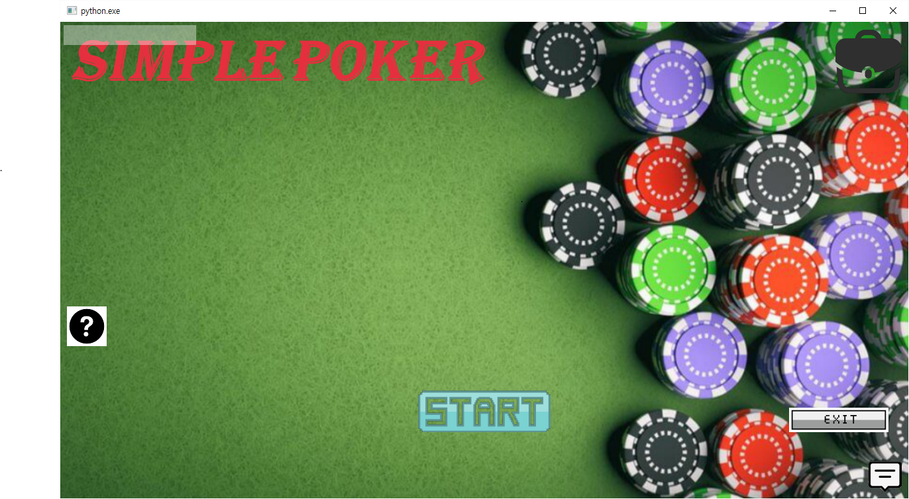
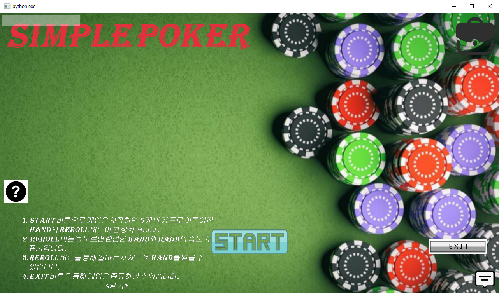
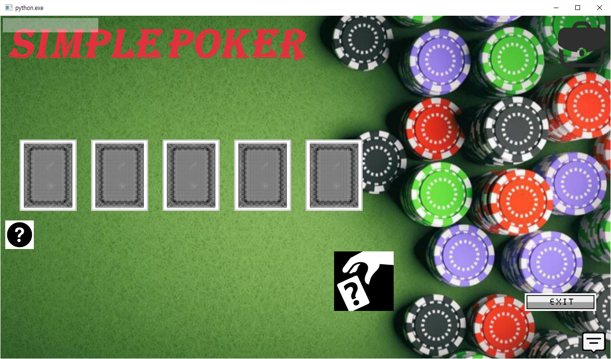
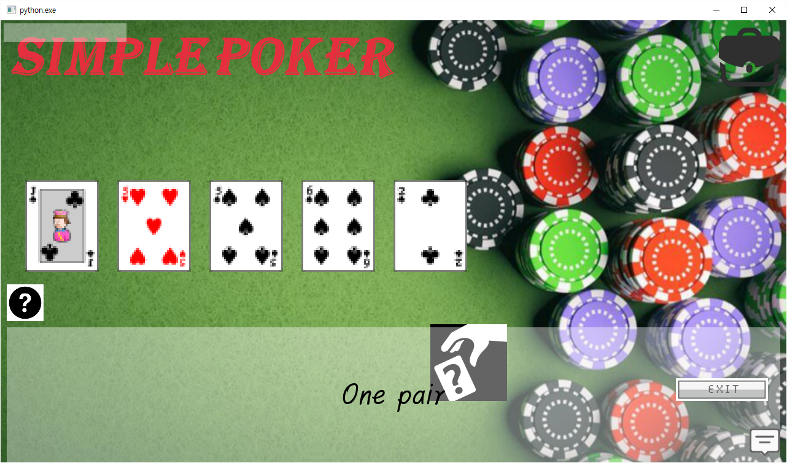

# "SIMPLE POKER"
This repository holds the **"SIMPLE POKER"** game project, a **personal assignment** of **Open Source S/W and Python Programming**.  
It is literally a game where you simply draw 5 cards and match your poker hand.
The deck consists of 52 standard cards excluding the wild cards(Joker).
## Openning

This is the first window you will see when you run the game.
1. You can run the game by clicking **start button**.
2. You can get a brief description of the game by clicking **? button**.
3. You can exit the game by clicking **exit button**.
## Help

You can see a brief description of the game written in Korean.  
You can close the help text by clicking **<닫기>**.  
You can check it again during gameplay or after closing the help text by pressing the question mark button.
## Ingame

If you clicked **start button**, the game starts with **5 backward cards** and **reroll button**.  

By clicking **reroll button**, you can get 5 random cards and the hand result in poker rules.  
**YOU CAN PLAY UNLIMITEDLY WITH REROLL BUTTON! Try the Royal Flush!!!**  
